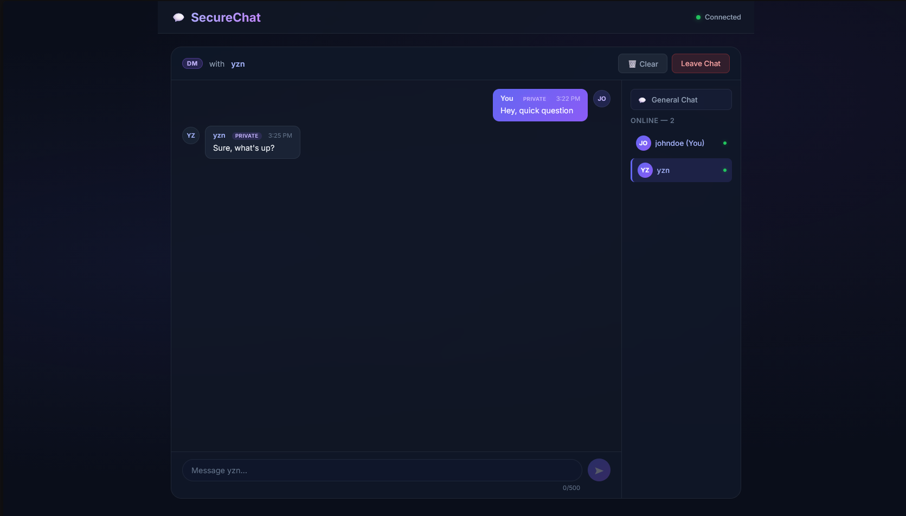
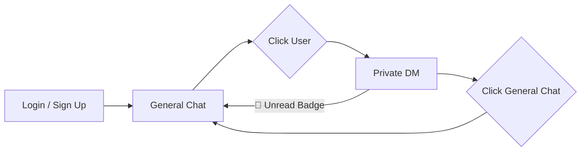

# 🔐 Secure Real-Time Chat Application

A professional, secure real-time chat application built with **ASP.NET Core + SignalR** backend and **React** frontend, featuring comprehensive authentication, brute force protection, and **private messaging**.

## 📸 Preview

### Login Screen


### General Chat


### Private Messaging (DM)


### Feature Flow




## 🚀 Features

### 🔥 **Core Chat Features**
- ✅ **Real-time messaging** - Instant message delivery across all connected clients
- ✅ **Private messaging** - Click any user to open an inline DM conversation
- ✅ **Unread badges** - Notification counter on users with new DMs
- ✅ **Clear chat** - One-click clear for both general and DM views
- ✅ **User authentication** - Secure username + password system
- ✅ **Online user list** - See who's currently connected
- ✅ **Message history** - Previous messages loaded on join
- ✅ **System notifications** - User join/leave announcements
- ✅ **Connection status** - Visual indicator with auto-reconnection
- ✅ **Responsive design** - Works perfectly on desktop and mobile

### 🛡️ **Security Features**
- ✅ **Brute force protection** - Rate limiting and account lockouts
- ✅ **Password security** - Strength requirements and secure hashing
- ✅ **IP tracking** - Automatic blocking for excessive attempts
- ✅ **Input validation** - XSS protection and sanitization
- ✅ **Progressive delays** - Increasing delays between failed attempts
- ✅ **Account lockouts** - 15-minute lockout after 5 failed attempts
- ✅ **Real-time feedback** - Countdown timers and security status

### 💎 **Professional Features**
- ✅ **No database required** - In-memory storage for easy deployment
- ✅ **Auto-reconnection** - Handles connection drops gracefully
- ✅ **Message persistence** - Messages survive until server restart
- ✅ **User colors** - Consistent color assignment per user
- ✅ **Timestamps** - Formatted message timing
- ✅ **Error handling** - Graceful error recovery and user feedback
- ✅ **Dark glassmorphism UI** - Modern premium theme with animations

## 🛠 **Tech Stack**

### **Backend**
- **ASP.NET Core 9.0** - Web API framework
- **SignalR** - Real-time WebSocket communication
- **C# 13** - Latest language features
- **In-Memory Storage** - No database complexity
- **SOLID Architecture** - Interface-driven services and repositories via DI

### **Frontend**
- **React 18** - Modern UI framework with hooks
- **SignalR JavaScript Client** - Real-time communication
- **Modern CSS** - Dark glassmorphism theme with animations
- **ES6+** - Latest JavaScript features

### **Security**
- **SHA256 Hashing** - Secure password storage
- **Rate Limiting** - Brute force attack prevention
- **Input Validation** - XSS and injection protection
- **CORS Configuration** - Secure cross-origin requests

## 🏗️ **Architecture**

The backend follows **SOLID principles** with a clean separation of concerns:

```
Backend/ChatApp.API/
├── Controllers/
│   ├── AuthController.cs          # REST endpoints for /api/auth and /api/logout
│   ├── DmController.cs            # REST endpoints for /api/dm
│   ├── MessagesController.cs      # REST endpoints for /api/messages
│   └── UsersController.cs         # REST endpoints for /api/users and /api/heartbeat
├── Hubs/
│   └── ChatHub.cs                 # SignalR hub for real-time WebSockets
├── Models/
│   ├── AuthRequest.cs
│   ├── AuthResponse.cs
│   ├── ChatMessage.cs
│   ├── IPAttemptTracker.cs
│   └── User.cs
├── Repositories/
│   ├── IUserRepository.cs         # User CRUD, session management & online state
│   ├── InMemoryUserRepository.cs
│   ├── IMessageRepository.cs      # Message storage, retrieval & since-filtering
│   └── InMemoryMessageRepository.cs
├── Services/
│   ├── IPasswordService.cs        # Hash, verify, strength validation
│   ├── PasswordService.cs
│   ├── IRateLimitService.cs       # IP tracking, brute-force protection
│   ├── RateLimitService.cs
│   ├── IAuthenticationService.cs  # Orchestrates auth flow
│   └── AuthenticationService.cs
└── Program.cs                     # DI registration, CORS, Controllers & SignalR middleware
```

All services are registered as **singletons** via dependency injection in `Program.cs`.

## 📋 **Prerequisites**

- [.NET 9.0 SDK](https://dotnet.microsoft.com/download/dotnet/9.0)
- [Node.js](https://nodejs.org/) (version 16.0 or later)
- [Git](https://git-scm.com/) for version control
- Modern web browser (Chrome 88+, Firefox 85+, Safari 14+, Edge 88+)

## 🔧 **Installation & Setup**

### **1. Clone Repository**

```bash
git clone https://github.com/YazanMohammad/ChatApp.git
cd ChatApp
```

### **2. Backend Setup**

```bash
cd Backend/ChatApp.API

# Restore dependencies
dotnet restore

# Build the project
dotnet build

# Run the backend
dotnet run
```

The backend will be available at:
- **HTTP**: `http://localhost:5237`
- **HTTPS**: `https://localhost:7115`
- **SignalR Hub**: `/chathub`

### **3. Frontend Setup**

```bash
cd frontend

# Install dependencies
npm install

# Start development server
npm start
```

> **Note (Node.js 24+):** If you're running Node.js 24 or later, start the dev server with:
> ```bash
> # PowerShell
> $env:NODE_OPTIONS="--openssl-legacy-provider"; npm start
>
> # Bash
> NODE_OPTIONS=--openssl-legacy-provider npm start
> ```
> This is needed because `react-scripts@4.0.3` uses an older webpack version incompatible with OpenSSL 3.x.

The frontend will be available at:
- **Development**: `http://localhost:3000`

## 🎯 **Usage**

### **Getting Started**
1. **Start Backend**: Run `dotnet run` in the Backend directory
2. **Start Frontend**: Run `npm start` in the frontend directory
3. **Open Browser**: Navigate to `http://localhost:3000`

### **Creating an Account**
1. Click **"Need an account? Sign up"**
2. Enter a **username** (2-20 characters, letters/numbers/underscore/hyphen)
3. Create a **password** (minimum 6 characters with letters and numbers)
4. Click **"Create Account"**

### **Logging In**
1. Enter your **username and password**
2. Click **"Login"**
3. Start chatting immediately!

### **Security Features in Action**

#### **Password Requirements**
- ✅ Minimum 6 characters
- ✅ Must contain letters AND numbers
- ✅ Blocks common weak passwords
- ✅ Real-time strength indicator

#### **Brute Force Protection**
- ⚠️ **5 failed attempts** → Account locked for 15 minutes
- ⚠️ **10 attempts per IP** → IP blocked for 5 minutes
- ⚠️ **Progressive delays** between attempts
- ⚠️ **Clear error messages** with countdown timers

## 🚀 **Deployment (100% Free)**

### **Backend Deployment (Railway)**

1. **Prepare for Production**
   ```bash
   # Create Dockerfile in Backend/ChatApp.API/
   ```

2. **Deploy to Railway**
   - Go to [railway.app](https://railway.app)
   - Sign up with GitHub
   - Click "New Project" → "Deploy from GitHub repo"
   - Select your repository
   - Railway auto-detects .NET and deploys
   - Get your API URL: `https://your-app.up.railway.app`

3. **Update CORS Settings**
   ```csharp
   // In Program.cs, update with your Netlify URL
   policy.WithOrigins(
       "http://localhost:3000",
       "https://your-chat-app.netlify.app"
   )
   ```

### **Frontend Deployment (Netlify)**

1. **Update Backend URL**
   ```bash
   # Create .env file in frontend/
   REACT_APP_BACKEND_URL=https://your-app.up.railway.app
   ```

2. **Deploy to Netlify**
   - Go to [netlify.com](https://netlify.com)
   - Sign up with GitHub
   - Click "New site from Git"
   - Configure build settings:
     - **Base directory**: `frontend`
     - **Build command**: `npm run build`
     - **Publish directory**: `frontend/build`
   - Add environment variable: `REACT_APP_BACKEND_URL`
   - Deploy!

### **Free Tier Limits**
- **Railway**: 500 hours/month (24/7 operation possible)
- **Netlify**: 100GB bandwidth/month
- **Total Cost**: $0/month

## 🔒 **Security Architecture**

### **Authentication Flow**
```
1. User enters username + password
2. Frontend validates input format
3. Backend checks IP rate limits (IRateLimitService)
4. Password strength validation for new users (IPasswordService)
5. Secure hash comparison for existing users (IPasswordService)
6. SignalR connection authorized on success
7. User set online and user list broadcast (IUserRepository)
```

### **Rate Limiting System**
```
IP Level (RateLimitService):
- Track attempts per IP address
- Max 10 attempts per 5 minutes
- Automatic IP blocking

User Level (AuthenticationService):
- Track attempts per username
- Max 5 attempts before lockout
- 15-minute lockout period
- Progressive warning messages
```

### **Password Security**
```
Requirements:
- Minimum 6 characters
- At least one letter
- At least one number
- Blocks common passwords

Storage:
- SHA256 with custom salt
- Never stored in plain text
- Frontend never stores passwords
```

## 📊 **API Documentation**

### **SignalR Hub Methods**

#### **AuthenticateAndJoin**
```javascript
await connection.invoke('AuthenticateAndJoin', username, password, isNewUser);
// Returns: { success: boolean, message: string, user?: User }
```

#### **SendMessage**
```javascript
await connection.invoke('SendMessage', username, message);
// Broadcasts to all connected clients
```

#### **LeaveChat**
```javascript
await connection.invoke('LeaveChat', username);
// Notifies other users of departure
```

### **SignalR Events**

#### **Client Receives**
- `ReceiveMessage` - New message from any user
- `UserJoined` - Someone joined the chat
- `UserLeft` - Someone left the chat
- `UpdateUserList` - Current online users
- `ChatHistory` - Previous messages on join
- `Error` - Error messages from server

## 🧪 **Testing**

### **Manual Testing**

#### **Basic Functionality**
1. **Multiple Users**: Open multiple browser tabs with different usernames
2. **Real-time Messaging**: Send messages and verify instant delivery
3. **Connection Handling**: Refresh page and test reconnection
4. **Mobile Testing**: Test on mobile devices for responsiveness

#### **Security Testing**
1. **Account Creation**: Test password strength requirements
2. **Failed Logins**: Try wrong passwords to trigger lockouts
3. **Rate Limiting**: Test multiple failed attempts from same IP
4. **XSS Protection**: Try sending HTML/JavaScript in messages

### **Automated Testing**
```bash
# Backend build verification
cd Backend/ChatApp.API
dotnet build

# Frontend component tests
cd frontend
npm test
```

## 🔧 **Configuration**

### **Backend Configuration**

#### **Security Settings**

Settings are distributed across focused services:

| Constant | Service | Default |
|----------|---------|---------|
| `MaxFailedAttempts` | `AuthenticationService` | 5 |
| `LockoutMinutes` | `AuthenticationService` | 15 |
| `MaxAttemptsPerIP` | `RateLimitService` | 10 |
| `WindowMinutes` | `RateLimitService` | 5 |
| `MaxMessages` | `InMemoryMessageRepository` | 1000 |

#### **CORS Settings** (Program.cs)
```csharp
// Add your production domains
policy.WithOrigins(
    "http://localhost:3000",
    "https://yourdomain.com"
)
```

### **Frontend Configuration**

#### **Centralized Config** (`src/config.js`)
```javascript
const config = {
  backendUrl: process.env.REACT_APP_BACKEND_URL || 'http://localhost:5237',
  maxMessageLength: 500,
  maxUsernameLength: 20,
  minUsernameLength: 2,
  minPasswordLength: 6,
  hubPath: '/chathub',
  maxReconnectAttempts: 3,
};
```

#### **SignalR Settings** (signalRService.js)
```javascript
.configureLogging(LogLevel.Warning)     // Debug: LogLevel.Debug
.withAutomaticReconnect()               // Auto-reconnection enabled
```

## 🚨 **Troubleshooting**

### **Common Issues**

#### **Connection Failed**
```
Error: Failed to complete negotiation
```
**Solutions:**
- Verify backend is running on correct port (`5237` by default)
- Check CORS configuration includes frontend URL
- Ensure firewall allows the ports

#### **Authentication Failed**
```
Error: Username not found
```
**Solutions:**
- Verify username exists (case-insensitive)
- Check if account is locked (wait for timeout)
- Ensure password meets requirements

#### **Account Locked**
```
Error: Account temporarily locked
```
**Solutions:**
- Wait for lockout period (15 minutes)
- Check server logs for security events
- Contact admin if repeatedly locked

#### **CORS Errors**
```
Access blocked by CORS policy
```
**Solutions:**
- Add frontend URL to backend CORS policy
- Restart backend after CORS changes
- Check for typos in domain names

#### **OpenSSL Error (Node.js 24+)**
```
ERR_OSSL_EVP_UNSUPPORTED
```
**Solution:** Set `NODE_OPTIONS=--openssl-legacy-provider` before running npm commands.

### **Debug Commands**

#### **Backend Debugging**
```bash
# Enable detailed logging
export ASPNETCORE_ENVIRONMENT=Development
dotnet run --verbosity detailed

# Check connection endpoints
curl http://localhost:5237/chathub/negotiate
```

#### **Frontend Debugging**
```bash
# Enable SignalR debug logging
# In signalRService.js: .configureLogging(LogLevel.Debug)

# Check console for detailed connection logs
# Browser DevTools → Console
```

## 📈 **Performance & Monitoring**

### **Performance Features**
- **Message Cleanup**: Automatically removes old messages (keeps last 1000)
- **Connection Pooling**: Efficient WebSocket management
- **Memory Management**: Garbage collection for disconnected users
- **Compression**: Automatic message compression for large payloads

## 🔄 **Future Enhancements**

### **Planned Features**
- [ ] **Message Reactions** - Emoji reactions to messages
- [ ] **File Sharing** - Upload and share images/documents
- [ ] **Private Messages** - Direct messaging between users
- [ ] **Chat Rooms** - Multiple chat channels
- [ ] **Voice Messages** - Audio message support
- [ ] **Message Search** - Search through chat history
- [ ] **Admin Panel** - User management and moderation

### **Database Migration**
When ready to scale beyond in-memory storage:
- **PostgreSQL** with Entity Framework Core
- **Message persistence** across server restarts
- **User profiles** with avatars and preferences
- **Advanced moderation** tools and user roles

## 🤝 **Contributing**

### **Development Setup**
1. Fork the repository
2. Create a feature branch (`git checkout -b feature/amazing-feature`)
3. Follow the coding standards and security practices
4. Write tests for new functionality
5. Submit a pull request with detailed description

### **Code Standards**
- **C#**: Follow Microsoft coding conventions
- **JavaScript**: Use ESLint configuration provided
- **Security**: Never commit passwords or secrets
- **Documentation**: Update README for new features

## 📄 **License**

This project is licensed under the MIT License - see the [LICENSE](LICENSE) file for details.

## 🙏 **Acknowledgments**

- [ASP.NET Core SignalR](https://docs.microsoft.com/en-us/aspnet/core/signalr/) - Real-time communication
- [React](https://reactjs.org/) - Frontend framework
- [Railway](https://railway.app/) - Backend hosting
- [Netlify](https://netlify.com/) - Frontend hosting
- Security best practices from [OWASP](https://owasp.org/)

## 📞 **Support**

### **Getting Help**
- 📖 **Documentation**: Read this README thoroughly
- 🐛 **Bug Reports**: Create an issue with detailed reproduction steps
- 💡 **Feature Requests**: Suggest improvements via GitHub issues
- 💬 **Community**: Join our discussions for questions and tips

---

**⭐ If this project helped you, please star the repository!**

**🚀 Happy Chatting! Built with ❤️ for secure real-time communication.**
