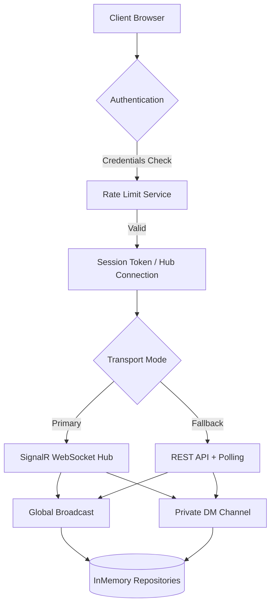

# 🔐 Secure Real-Time Chat Application

[](https://dotnet.microsoft.com/)
[](https://reactjs.org/)
[](https://docs.microsoft.com/en-us/aspnet/core/signalr/)
[](https://www.docker.com/)
[](LICENSE)

A production-ready, secure real-time messaging platform built with **ASP.NET Core 9 + SignalR** on the backend and **React 18** on the frontend. Features enterprise-grade authentication, dual-tier brute-force protection, real-time WebSockets with REST fallback polling, direct private messaging (DMs), and a modern dark glassmorphism UI.

---

## 📑 Table of Contents

- [� Secure Real-Time Chat Application](#-secure-real-time-chat-application)
  - [📑 Table of Contents](#-table-of-contents)
  - [📸 Preview](#-preview)
    - [Login Screen](#login-screen)
    - [General Chat](#general-chat)
    - [Private Messaging (DM)](#private-messaging-dm)
    - [Feature \& Communication Flow](#feature--communication-flow)
  - [✨ Core Features](#-core-features)
    - [💬 **Real-Time \& Private Messaging**](#-real-time--private-messaging)
    - [🛡️ **Enterprise Security**](#️-enterprise-security)
    - [💎 **User Experience \& Architecture**](#-user-experience--architecture)
  - [🛠️ Tech Stack](#️-tech-stack)
  - [🏗️ Architecture \& Project Structure](#️-architecture--project-structure)
  - [📋 Prerequisites](#-prerequisites)
  - [🚀 Quick Start \& Local Setup](#-quick-start--local-setup)
    - [1. Clone Repository](#1-clone-repository)
    - [2. Backend Setup (.NET 9)](#2-backend-setup-net-9)
    - [3. Frontend Setup (React)](#3-frontend-setup-react)
    - [4. Docker Setup (Optional)](#4-docker-setup-optional)
  - [🔒 Security Architecture](#-security-architecture)
    - [Authentication Flow](#authentication-flow)
    - [Brute Force \& Rate Limiting](#brute-force--rate-limiting)
    - [Password Security](#password-security)
  - [📊 API Documentation](#-api-documentation)
    - [SignalR Hub Methods \& Events](#signalr-hub-methods--events)
      - [Client Invokes (Methods)](#client-invokes-methods)
      - [Client Listens (Events)](#client-listens-events)
    - [REST API Endpoints](#rest-api-endpoints)
      - [Authentication \& User State](#authentication--user-state)
      - [Messages \& DMs](#messages--dms)
  - [🤝 Contributing \& License](#-contributing--license)

---

## 📸 Preview

### Login Screen


### General Chat


### Private Messaging (DM)


### Feature & Communication Flow



---

## ✨ Core Features

### 💬 **Real-Time & Private Messaging**
- **Instant Delivery**: WebSocket communication via ASP.NET Core SignalR for sub-millisecond updates.
- **Direct Messaging (DM)**: One-on-one private conversations with inline user switching.
- **Unread Counter Badges**: Real-time badges indicating pending unread DMs per online user.
- **Chat History & Persistence**: Automatic retrieval of recent channel & DM message history upon connection.
- **System Announcements**: User join, leave, and disconnection notifications broadcasted live.
- **REST + Polling Fallback**: Built-in fallback HTTP polling mechanism when WebSockets are blocked or disconnected.

### 🛡️ **Enterprise Security**
- **Brute Force Protection**: Dual-level rate limiting at both the IP address and User account level.
- **Account Lockouts**: Automatic 15-minute account lockout after 5 consecutive failed login attempts.
- **IP Rate Limiting**: 5-minute block after 10 failed login attempts from a single IP.
- **Password Strength Enforcement**: Minimum length, character diversity requirements, and SHA256 salted hashing.
- **XSS & Injection Defense**: Robust server-side and client-side message sanitization.
- **Secure Session Management**: HTTP-only HttpContext cookies for REST endpoints and token tracking.

### 💎 **User Experience & Architecture**
- **Dark Glassmorphism UI**: Premium visual aesthetics with CSS backdrop filters, gradients, and micro-animations.
- **Responsive Layout**: Designed for mobile, tablet, and desktop viewports.
- **Clean Code Architecture**: Solid C# backend applying Repository, Service, and Controller separation of concerns.
- **Zero Database Setup**: Lightweight in-memory state repository for rapid zero-dependency deployment.

---

## 🛠️ Tech Stack

| Domain | Technology | Purpose |
| :--- | :--- | :--- |
| **Backend Framework** | ASP.NET Core 9.0 | High-performance Web API & Middleware |
| **Real-Time Engine** | ASP.NET Core SignalR | Bidirectional WebSockets with fallback |
| **Language** | C# 13 / ES6+ JavaScript | Strongly typed backend & dynamic client logic |
| **Frontend UI** | React 18 | Component-driven declarative UI framework |
| **Styling** | Modern Vanilla CSS | Custom Glassmorphism design system & CSS variables |
| **Security** | SHA256 / RateLimitService | Password hashing, IP tracking & brute force protection |
| **Containerization** | Docker | Multi-stage Docker container build |

---

## 🏗️ Architecture & Project Structure

The project strictly follows **SOLID design principles** with dependency injection, interface segregation, and clean architecture separation between WebSockets, REST endpoints, services, and repositories.

```
ChatApp/
├── Backend/
│   └── ChatApp.API/
│       ├── Controllers/
│       │   ├── AuthController.cs      # REST endpoints: POST /api/auth, /api/logout
│       │   ├── DmController.cs        # REST endpoints: GET/POST /api/dm
│       │   ├── MessagesController.cs  # REST endpoints: GET/POST /api/messages
│       │   └── UsersController.cs     # REST endpoints: GET /api/users, POST /api/heartbeat
│       ├── Hubs/
│       │   └── ChatHub.cs             # Real-time WebSocket hub methods & events
│       ├── Models/
│       │   ├── AuthRequest.cs         # Data models for authentication
│       │   ├── AuthResponse.cs
│       │   ├── ChatMessage.cs         # Unified broadcast & DM message structure
│       │   ├── IPAttemptTracker.cs    # IP tracking metrics
│       │   └── User.cs                # User domain model
│       ├── Repositories/
│       │   ├── IUserRepository.cs     # User state & session interface
│       │   ├── InMemoryUserRepository.cs
│       │   ├── IMessageRepository.cs  # Thread-safe message buffer interface
│       │   └── InMemoryMessageRepository.cs
│       ├── Services/
│       │   ├── IPasswordService.cs    # Password validation & hashing interface
│       │   ├── PasswordService.cs
│       │   ├── IRateLimitService.cs   # IP & brute force rate limiter interface
│       │   ├── RateLimitService.cs
│       │   ├── IAuthenticationService.cs # Core auth logic orchestrator
│       │   └── AuthenticationService.cs
│       ├── Dockerfile                 # Backend containerization file
│       └── Program.cs                 # Dependency Injection, Middleware & SignalR routes
├── frontend/
│   └── src/
│       ├── components/
│       │   ├── Chat.js                # Main chat window container
│       │   ├── ConnectionStatus.js    # Visual WebSocket status indicator
│       │   ├── MessageInput.js        # Text composer component
│       │   ├── MessageList.js        # Message stream rendering component
│       │   └── UserSetup.js           # Authentication & Registration form
│       ├── services/
│       │   ├── signalRService.js      # WebSocket client connection manager
│       │   └── pollingService.js      # HTTP REST fallback polling service
│       ├── config.js                  # Centralized client configuration settings
│       ├── App.js                     # React root component & routing logic
│       └── App.css                    # Glassmorphism styling rules
├── Dockerfile                         # Root multi-stage Docker build file
└── README.md
```

---

## 📋 Prerequisites

Ensure you have the following installed locally:

- **[.NET 9.0 SDK](https://dotnet.microsoft.com/download/dotnet/9.0)**
- **[Node.js](https://nodejs.org/)** (v16.0 or higher)
- **[Docker Desktop](https://www.docker.com/)** *(Optional, for containerized execution)*
- **Git**

---

## 🚀 Quick Start & Local Setup

### 1. Clone Repository

```bash
git clone https://github.com/YazanMohammad/ChatApp.git
cd ChatApp
```

### 2. Backend Setup (.NET 9)

```bash
cd Backend/ChatApp.API

# Restore dependencies
dotnet restore

# Build and run the project
dotnet run
```

Backend service endpoints:
- **HTTP**: `http://localhost:5237`
- **HTTPS**: `https://localhost:7115`
- **SignalR Hub**: `http://localhost:5237/chathub`

### 3. Frontend Setup (React)

Open a new terminal tab/window:

```bash
cd frontend

# Install node dependencies
npm install

# Start development server
npm start
```

> ⚠️ **Node.js 24+ Compatibility Note:**
> If using Node.js 24 or newer, run the start command with the legacy OpenSSL flag:
> ```bash
> # Linux / macOS (Bash)
> NODE_OPTIONS=--openssl-legacy-provider npm start
>
> # Windows (PowerShell)
> $env:NODE_OPTIONS="--openssl-legacy-provider"; npm start
> ```

The frontend web app will open at `http://localhost:3000`.

### 4. Docker Setup (Optional)

To run the application inside a Docker container:

```bash
# Build Docker image
docker build -t chathub .

# Run container on port 8080
docker run -p 8080:8080 chathub
```

---

## 🔒 Security Architecture

### Authentication Flow

```
1. User submits Username + Password (or registers new account)
2. Client sends request to AuthController (/api/auth) or SignalR Hub (AuthenticateAndJoin)
3. RateLimitService evaluates IP attempt count (Blocks IP if > 10 failed attempts)
4. AuthenticationService checks account lockout status (Locks account if > 5 failed logins)
5. PasswordService evaluates strength rules (New users) or verifies SHA256 hash (Existing users)
6. Upon success:
   - Session token issued & set in HTTP-only cookie (chat_session)
   - User state marked Online & active WebSocket connection registered
   - Presence update & user list broadcasted to active clients
```

### Brute Force & Rate Limiting

| Level | Threshold | Action / Lockout Duration | Responsible Service |
| :--- | :--- | :--- | :--- |
| **User Account** | 5 failed attempts | 15-minute account lockout | `AuthenticationService` |
| **IP Address** | 10 failed attempts | 5-minute IP address block | `RateLimitService` |
| **Message Length** | 1,000 chars (Hub) / 500 chars (REST) | Message truncation / rejection | `ChatHub` & `MessagesController` |

### Password Security

- **Min Length**: 6 characters
- **Complexity**: Must contain letters and numbers
- **Storage**: SHA256 hashing with custom salt derivation
- **Privacy**: Passwords are never logged, exposed in APIs, or saved on client local storage.

---

## 📊 API Documentation

### SignalR Hub Methods & Events

**Hub Route:** `/chathub`

#### Client Invokes (Methods)

| Method | Parameters | Return Type | Description |
| :--- | :--- | :--- | :--- |
| `AuthenticateAndJoin` | `username` (string), `password` (string), `isNewUser` (bool) | `AuthResponse` | Authenticates account and registers SignalR connection |
| `SendMessage` | `username` (string), `message` (string) | `Task` | Broadcasts a message to all connected clients in global chat |
| `SendPrivateMessage` | `recipient` (string), `message` (string) | `Task` | Sends a private message (DM) directly to specified user |
| `GetPrivateHistory` | `otherUser` (string) | `Task` | Fetches private conversation history with target user |
| `LeaveChat` | `username` (string) | `Task` | Unregisters online status and notifies channel |

#### Client Listens (Events)

| Event Name | Payload | Description |
| :--- | :--- | :--- |
| `ReceiveMessage` | `ChatMessage` object | Triggered when a new global chat message is sent |
| `ReceivePrivateMessage` | `ChatMessage` object | Triggered when a private DM is sent/received |
| `UserJoined` | `username` (string) | System alert when a user connects |
| `UserLeft` | `username` (string) | System alert when a user disconnects |
| `UpdateUserList` | `List<User>` | Active online user list update |
| `ChatHistory` | `List<ChatMessage>` | Initial payload of past global messages |
| `PrivateHistory` | `List<ChatMessage>` | Initial payload of past private messages |
| `Error` | `string` error message | Triggered on validation or authentication errors |

---

### REST API Endpoints

#### Authentication & User State

- `POST /api/auth`
  - **Body:** `{ "username": "string", "password": "string", "isNewUser": false }`
  - **Response:** 200 OK with session cookie, 429 Lockout, 401 Unauthorized, 409 Conflict.
- `POST /api/logout`
  - **Response:** Clears `chat_session` cookie and invalidates session token.
- `GET /api/users`
  - **Response:** Returns list of online users `[{ "username": "string", "displayColor": "string" }]`.
- `POST /api/heartbeat`
  - **Response:** Refreshes user active state to prevent offline pruning.

#### Messages & DMs

- `GET /api/messages?since={timestamp}`
  - **Response:** Returns recent global messages (or messages since UNIX timestamp).
- `POST /api/messages`
  - **Body:** `{ "message": "string" }`
  - **Response:** 201 Created with `ChatMessage` payload.
- `GET /api/dm?with={username}&since={timestamp}`
  - **Response:** Returns private message history with specified target user.
- `POST /api/dm`
  - **Body:** `{ "recipient": "string", "message": "string" }`
  - **Response:** 201 Created with `ChatMessage` payload.

---

## 🤝 Contributing & License

Contributions are welcome! Please follow these guidelines:

1. Fork the repository.
2. Create a topic branch (`git checkout -b feature/amazing-feature`).
3. Commit your changes adhering to standard C# and JavaScript style guidelines.
4. Push to your branch and submit a Pull Request.

Distributed under the **MIT License**. See [`LICENSE`](LICENSE) for more details.
